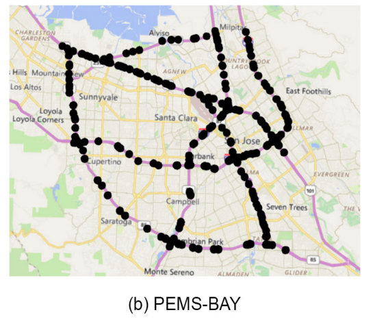

# Traffic Imputation

This project is focused on traffic imputation and is based on two key research papers and their associated code repositories:

- GRIN (Graph Recurrent Imputation Network) - [Repository](https://github.com/Graph-Machine-Learning-Group/grin)
- CSDI (Code Synthesis for Data Imputation) - [Repository](https://github.com/ermongroup/CSDI)

## My Contribution

- Implement diffusion model (CSDI) using Pytorch lightning (view csdi and diffmodels in https://github.com/willtryagain/traffic-imputation/tree/main/lib/nn/models, train_csdi script)
- Use mode-parallel training (FSDP) after manual wrapping
- Experimentation and visualization using wandb
- Parameter selection based on computational constraints and performance

## Data and Visuals

- PEMS-BAY 
- Traffic Evolution 

##  Running
 
> python -m scripts.train_csdi --config config/csdi/bay_point.yaml

## Requirements
>  conda env create -f grinc.yml

## Citations

- [GRIN Paper](https://arxiv.org/abs/2108.00298)
- [CSDI Paper](https://arxiv.org/abs/2107.03502)
- [Feature Propagation Paper](https://arxiv.org/abs/2111.12128)
- [DRCNN Paper](https://arxiv.org/abs/1707.01926)
- [LCR Paper](https://arxiv.org/abs/2212.01529)
